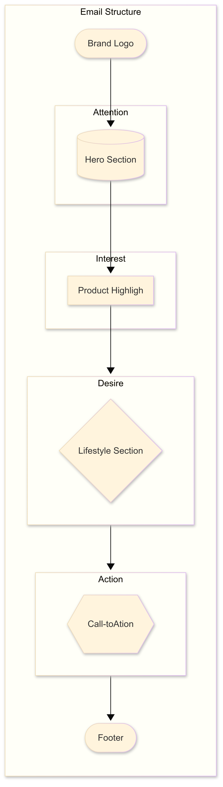
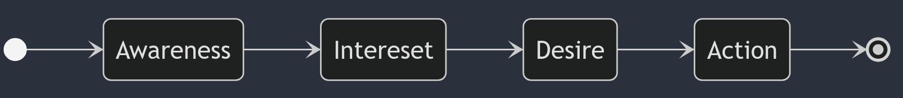
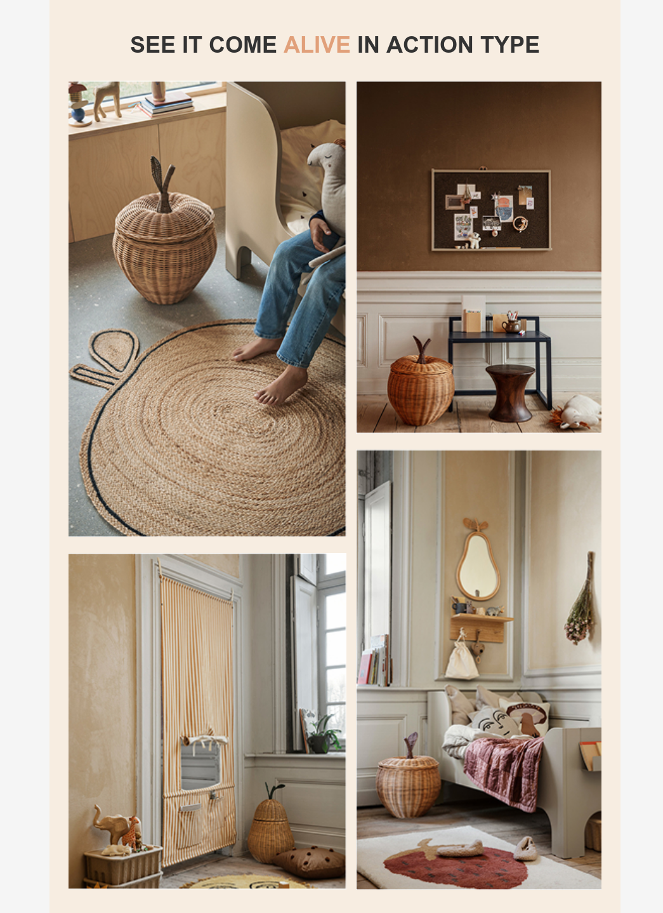
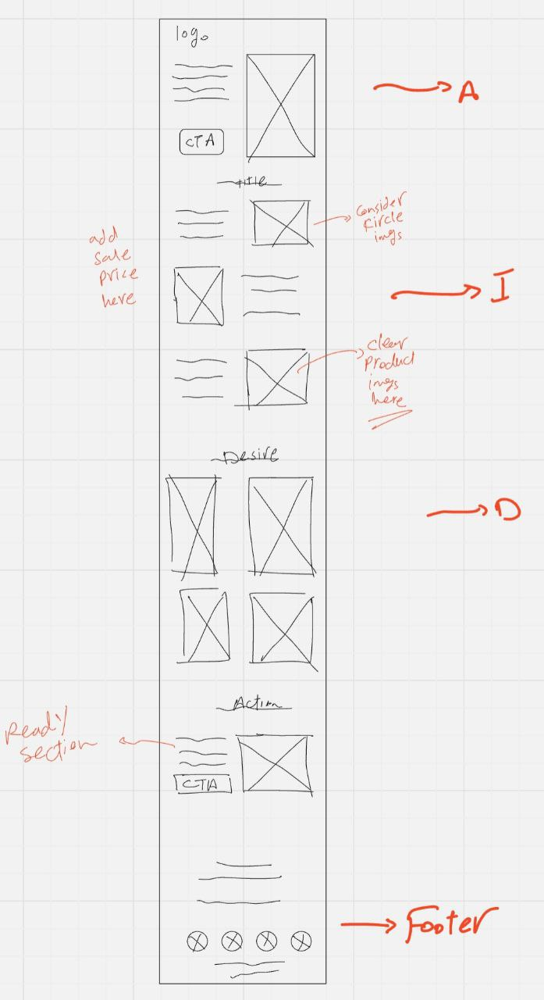

# Ferm Living Promotional Email Project

A complete email marketing campaign showcasing the end-to-end process of creating a professional promotional email for Ferm Living furniture brand.

> 📄 **[View High-Quality PDF Version](docs/01-final-email-design.pdf)** - Perfect for detailed review and printing

## 🎥 Project Walkthrough

**[Watch the complete project walkthrough on YouTube](https://www.youtube.com/watch?v=qy4uyZSyXTc)**

This video demonstrates the entire workflow from initial brand research to final email testing across multiple devices and email clients.

## 📋 Project Overview

This project showcases a comprehensive approach to email marketing design and development, featuring:

- **Strategic Planning**: Implementation of the AIDA marketing framework (Attention, Interest, Desire, Action)
- **Brand Research**: Comprehensive mood boarding and visual identity analysis
- **Design Process**: Complete UI/UX design workflow in Figma
- **Email Development**: Hand-coded HTML/CSS optimized for email clients
- **Cross-Platform Testing**: Testing across Gmail, Outlook, and multiple devices

## 🎯 Project Goals

- Promote two Ferm Living braided storage products
- Drive conversions and sales through strategic email design
- Demonstrate professional email development workflow
- Showcase cross-client compatibility and responsive design

## 🛠️ Technologies & Tools Used

### Development
- **HTML/CSS**: Table-based layout optimized for email clients

### Design & Research
- **Figma**: Complete email design and prototyping
- **Brand Research**: Color palette generation, typography analysis
- **Photography**: High-quality product and lifestyle imagery integration

## 📧 Email Structure

The email follows a strategic 6-section layout:

1. **Brand Logo**: Establishes trust and recognition
2. **Hero Section**: Attention-grabbing visuals and messaging
3. **Product Highlights**: Zigzag layout showcasing featured products
4. **Lifestyle Gallery**: Desire-driven lifestyle imagery
5. **Call-to-Action**: Clear conversion-focused section
6. **Footer**: Complete brand information and social links

## 🎨 Design Approach

### AIDA Marketing Framework Implementation

The email strategically implements the AIDA framework:

- **Attention**: Eye-catching hero section with compelling visuals
- **Interest**: Strategic product presentation with pricing psychology
- **Desire**: Lifestyle imagery showing products in real-world contexts
- **Action**: Strong call-to-action driving users to purchase

## 🔧 Technical Highlights

### Email-Specific Development Techniques
- Table-based layout structure
- Inline CSS for maximum compatibility
- VML fallbacks for Outlook
- Bulletproof button implementation

### Complex Layout Examples

**Advanced CSS Gallery Layout:**

## 🎬 Behind the Scenes

This project represents a complete professional workflow including:

- **Strategic Planning**: Understanding client goals and target audience
- **Research Phase**: Comprehensive brand analysis and competitive research
- **Creative Process**: From initial sketches to final Figma designs
- **Development**: Hand-coded HTML/CSS with email-specific optimizations
- **Quality Assurance**: Multi-device and cross-client testing

## 💼 Professional Context

This project demonstrates:
- **Frontend Development Skills**: HTML/CSS, responsive design, cross-browser compatibility
- **Email Marketing Expertise**: Client-specific optimization, deliverability best practices
- **Design Thinking**: User experience, conversion optimization, brand consistency
- **Project Management**: Complete workflow from research to deployment
